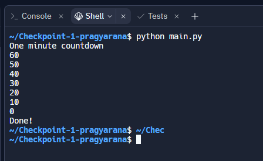

# Building in Replit

## Shell 
Another way to run your file in Replit is to use the `Shell` tab. Inside Shell, type: `"python file_name.py"`


## Setting Entrypoint
You'll want to change which file you build so that you can run either your functional code or your tests.
To do this, you'll want to modify the `.replit` file which is hidden in the `Config files` section that
you can't see until you `Show hidden files`.  

To run a different file, change `.replit` in two ways:  
1) The `run` value references the file that you want to run. For example, the snippet of code below is set up to run `hw1_test.py`.  
2) The `entrypoint` value references the file you want to run. (I've noticed that at times it doesn't seem like this needs to be updated and other times it does. Perhaps a student can give me authoratitive answer as to when or whether 'entrypoint' needs to be updated.) 

```bash
run = "python hw1_test.py"

entrypoint = "main.py"
# A list of globs that specify which files and directories should
# be hidden in the workspace.
hidden = ["venv", ".config", "**/__pycache__", "**/.mypy_cache", "**/*.pyc"]
```

## Main-Pattern
When you run a specific python file, that file should have the `main-pattern`. Here is an example
file that follows the main-pattern.

```python
'''
<Students Name Here>
<Homework Info Here>
'''

def problem_0(arg)
    '''
    problem_0 will take an integer argument and print it.
    '''
    print(arg)


def main():
    problem_0(5)


if __name__ == '__main__':
    main()
```


