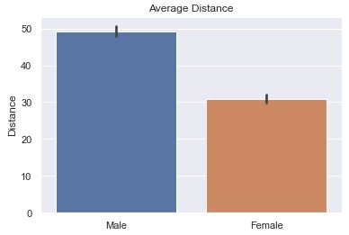
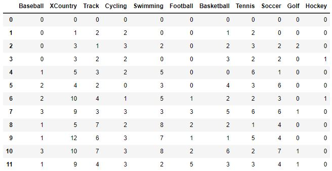
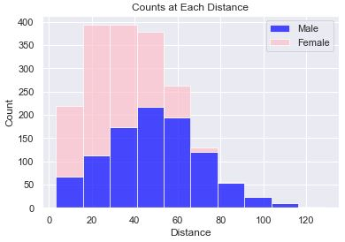
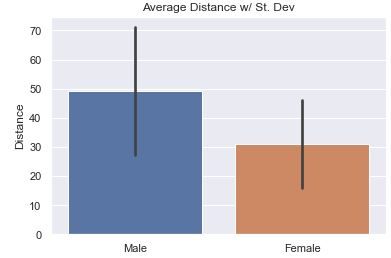
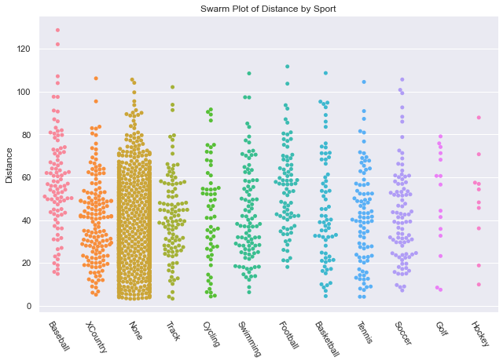
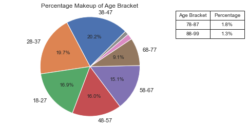
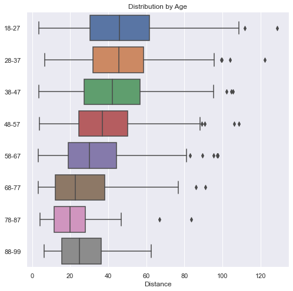
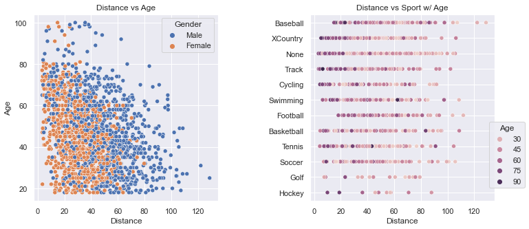
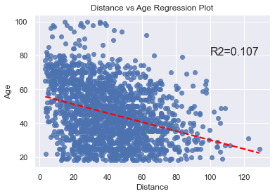

# Case Study on Distance
This page will present graphs for a 'fake' research project. It will show you both good graphs and bad graphs and a brief summary of what the graph means. It will provide the code used to generate the graphs as well a short discussion on the code: how the code works, why the code was selected, and potential pitfalls to watch out for when generating your own.  

This exercise is intended to show how one can be creative in examining and visualizing data to surface true insights.  

This exercise is **NOT** intended to show how to *clean* the data nor how to *test* the code.  

```{admonition} See Imports
:class: dropdown
Here are the imports and Seaborn initialization used in the code on this page. Furthermore, the code herein does not include saving the image to a file. Because the code was developed in Jupyter Notebook, we include `%matplotlib inline`.
```python
import numpy as np
import pandas as pd
import matplotlib.pyplot as plt
import matplotlib.ticker as mtick

import seaborn as sns

import scipy.integrate as integrate
from scipy.optimize import curve_fit
from scipy import stats

sns.set()

# This if for Jupyter Notebook only
%matplotlib inline
```

## Background of Hypothetical Project
This a hypothetical research project on **contrived data**. This dataset was **created** and is not real-life data. We pretend that this data was collected in the following hypothetical situation:  
* A random set of people (18 or older) were asked to throw a baseball. The distance was measured.  
* The person gave their age and gender. For simplicity, only male/female genders were considered.  
* The person was allowed to select a _single_ sport that they felt best represented their past (or present) athletic training. If a sport was selected, the person was supposed to have reached at least a high school varsity level in that selected sport.  
* The distance unit is yards. (but this metric is left out of all plots)  

A total of 1866 people's responses were recorded.

Here is a sample of the data. These are the people with the top 10 and bottom 10 distance values:  
  

Note that our is "clean" and is not riddled with `NaN` or errors. 
- - - 

## Worthless Graphs
Here are a set of common and essentially worthless graphs. A Final Report with only these plots in their report would be poor. These graphs are simple and not very insightful. Furthermore, one of the plots is mislabeled and misleading.    
````{tab-set}
```{tab-item} Average
The most common question would be to see the average distance thrown by gender. Here is the basic bar plot of that data. The small 'tick' or 'bar' at the top represents a range showing 95% confidence that the 'true mean' is within the range of the black bar. It assumes that the data we have is a sample from the true population and that it isn't 100% representative. With the count of data points present, the bar represents with 95% confidence where would the mean actuall fall in the true population. 

Is the bar helpful? <a href="https://youtu.be/a2xZrXzuwyk" target="_blank">I think NOT!! (click for Video Reference)</a>  

  

The default is to have `ci=95` or not defined at all. What you see below is 
'sd' (St. Dev) is much better because we are not so focused on our confidence in the average so much as the variance in the distance. 
```python
def sns_bar_stats(df, ci):
    # display the line with something other than the default %95 confidence interval.
    sns.barplot(data=df, x='gender', y='distance', ci=ci)
    plt.ylabel('Distance')
    plt.xlabel('')
    plt.title('Average Distance')
```
```{tab-item} Distance vs Sport  
The idea was to show how each sport compares against other sport by showing how many people
were able to throw the ball at each specific distance. There are too many lines for one to make
much sense of anything. Furthermore, the x-axis is mislabeled! It presents itself as the distance
a person threw the ball, but in reality it represents a 'bin' (or a range of distances). There are
40 bins, each representing a range of 3. The graph makes it looks like the x-axis is the actual distance 
thrown instead of a bin number.  
  

```{admonition} See Data and Code
:class: dropdown
To understand the code a bit better, let's take a peek at what `df_buckets` looks like after it is created in the code below:  
  

```python
def sport_hist(df):
    df_buckets = pd.DataFrame()
    # Define bin edges
    bins = range(0, 140, 3)
    sports = df['sport'].unique()
    # remove 'None' from the list of sports
    sports = [ s for s in sports if s != 'None']
    
    for sport in sports:
        # get histogram values by having numpy put into bins for us
        df2 = df[df['sport'] == sport]['distance']
        bars, bins = np.histogram(df2, bins=bins)
        df_buckets[sport] = bars
    
    # Set up plot
    sns.lineplot(data=df_buckets)
    plt.title('Distance vs Sport')
    plt.xlabel('Distance')
    plt.ylabel('Count')
    plt.legend()
```
```{tab-item} Gender w/ Sport & Age
This plot isn't *horrible* as it combines all three features into a single plot. The sports are identified by the color of the dots where we can clearly see that 'None' dominates the base of the plot. The age of the person is denoted by the size of the dots where it appears that the base of the plot is wider. If you squint, it kind of looks like two skinny spikes, sharper and redder at the top. It would mean that those who hadn't done any sport at all and are older throw the shortest. Those who played baseball and are younger throw the farthest.   

However, there are still many questions and issues. The spikes are far apart and don't leverage the graphing space well. The colors are hard to discern from one another (e.g. perhaps XCountry folks throw the farthest). It doesn't tell us how much farther one sport throws over another, the average distance, the variance, or many other interesting statistics about the data. The spikes are too skinner and compact to illucidate truly useful information.   

  

```python
def scatter_plot(df):
    '''
    Create a scatter plot by gender with sports in color, age in size.
    '''
    sns.relplot(data=df, x='gender', y='distance', hue='sport', size='age')
    plt.title('Distance versus Gender w/ Sport & Age')
    plt.xlabel('')
    plt.ylabel('Distance')
```
```{tab-item} Stacked Bars
This plot shows the count of people at various distances. We can see that the male gender has a curve that looks to be a 'normal distribution'. Stacked on top of the male gender is the female gender. The stacking of the bars allows us to get an idea of the distribution of the entire sample set, but it doesn't allow us to see how the female gender is distributed.   
  

```python
def stacked_hist(df):
    male_data = df[df['gender'] == 'Male']['distance']
    female_data = df[df['gender'] == 'Female']['distance']
    plt.hist([male_data, female_data], histtype='barstacked', bins=10, alpha=0.7, color=['blue', 'pink'])
    plt.xlabel('Distance')
    plt.ylabel('Count')
    plt.title('Counts at Each Distance')
    plt.legend(['Male', 'Female'])
```
```{tab-item} Sports Histogram
This plot turned out so bad that I didn't even attempt to fix the fact that the x-axis labels are occluded, the y-axis ranges don't match, the color of all the bars are blue (don't differentiate themselves), and that there are gaps the bars. It is just ugly and upon first inspection, I knew that I didn't want to go any further with this plot. 
 

To get the bars to line up uniformly, we explicitly set the bins using `range(0, 140, 3)`. 
We generated a new `DataFrame` called `df_buckets` and set the height of the bars to be the count of people
within that bin. This is done for us using `np.histogram`.  Then, we enumerated through each sport and
plotted a histogram. We set the y-axis label on each axis so that we'd know which sport that subplot
was presenting. 
```{admonition} See Code
:class: dropdown
```python
def sport_hist_by_sides(df):
    df_buckets = pd.DataFrame()
    # Define bin edges
    bins = range(0, 140, 3)
    sports = df['sport'].unique()
    
    for sport in sports:
        # get histogram values by having numpy put into bins for us
        df2 = df[df['sport'] == sport]['distance']
        bars, bins = np.histogram(df2, bins=bins)
        df_buckets[sport] = bars
    
    fig, axes = plt.subplots(len(sports), figsize=(8, 15))
    for i, sport in enumerate(sports):
        # plot a sport histogram on each subplot
        data = df[df['sport'] == sport]
        axes[i].hist(data['distance'], bins=bins)
        axes[i].set_ylabel(sport)
```
````

## Data by Gender
It is always a good idea to get a firm idea of what the data comprises. In these next few plots we show how the data differs by gender. 

````{tab-set}
```{tab-item} Pie
The following pie chart shows us how many men and women there are. We can see that in this (fake) study, we had more men than women likely due to some bias in how the data was collected.

 

The code to generate this pie chart will was the same as the more complicated pie charts below. In short, it was:  
```python
# Calculate the percentages of each gender
counts = df['gender'].value_counts()
percentages = counts / counts.sum() * 100
plt.figure(figsize=(8, 6))
plt.pie(percentages, labels=percentages.index, autopct=lambda pct: f'{pct:.1f}%', startangle=45)
```
```{tab-item} Average
As stated above, the most common question would be to see the average distance thrown by gender. Here we show the average along with the Standard Deviation in the data. The bar is relatively long showing that there is a good amount of variance in the data. 

  
```python
# code snippet (see 'Average' tab above for more code)
sns.barplot(data=df, x='gender', y='distance', ci='sd')
```
```{tab-item} Histogram
In this histogram plot we have each gender plotted, female on top of male using a transparency (`alpha=0.7`). The transparency allows us to see both sets of bars, layered on top of one another, and that there is a 'normal distribution' for both genders. In this code, we explicitly set the boundaries of the bins so that we could easily know that the bin sizes were 10. Alternatively, we could have set the count of bins. However, setting the count of bins made it such that the female bin sizes were different because of the overall range being different. Setting the bin boundaries allows for the bars to line up nicely. 

The chart reveals that women are mostly likely to throw between 20-30 yards while men are most likely to throw between 40-50 yards. Also, women peak out at about 80 yards while men peak out around 110 with what appears to be an outlier(s) beyond 120 yards.  

 
```{admonition} See Code
:class: dropdown
``` python
def simple_hist(df):
    male_data = df[df['gender'] == 'Male']['distance']
    female_data = df[df['gender'] == 'Female']['distance']

    # Set up plot
    fig, ax = plt.subplots()

    # Define bin edges
    bins = range(0, 140, 10)

    # Plot histogram for males
    ax.hist(male_data, bins=bins, color='blue', alpha=0.7, label='Male')

    # Plot histogram for females
    ax.hist(female_data, bins=bins, color='pink', alpha=0.7, label='Female')
    ax.legend()
    plt.xlabel('Distance')
    plt.ylabel('Count')
    plt.title('Distance Histogram by Gender')
```

```{tab-item} Swarm
This plot provides a nice visual into the distribution of distance by gender. It gives more detail into how many people are at various distances. It reveals that men have a much broader spread of distances.
 
``` python
def swarm_plot(df):
    df2 = df[df['sport'] == 'None']
    sns.catplot(data=df2, x='gender', y='distance', kind='swarm')
    plt.xlabel('')
    plt.ylabel('Distance')
    plt.title('Swarm Plot of Distance by Gender')
```
````

## Data by Sport
Let's see if we can learn how the sport impacts the distance thrown. We already saw that a line plot was horrible. However, when examining the data by gender, we saw that a histogram provided some decent data, while a swarm plot was better. Attempts at these two plots showed that we needed to do even better. And, so we moved onto the better option, a box plot.
````{tab-set}
```{tab-item} Pie Chart
This pie chart shows how the sports compose both the male and female genres. We can see that more women do not affiliate with any sport at all, and that women are not a part of football.
  
```{admonition} See Code
:class: dropdown
```python
def plot_pie(ax, df, col_name, display_name):
    # Calculate the percentages of each category
    counts = df[col_name].value_counts()
    percentages = counts / counts.sum() * 100
   
    label_threshold = 2
    # Define the autopct formatting function
    def autopct_format(pct):
        return f'{pct:.1f}%' if pct >= label_threshold else ''

    # Create a list of labels based on the threshold
    labels = [name if percentages[name] >= label_threshold else '' for name in percentages.index]

    ax.pie(percentages, labels=labels, autopct=autopct_format, startangle=45)

    plt.axis('equal')
    ax.set_title('Percentage Makeup of ' + display_name)
    
    # Identify sports for the table that were not annotated
    not_annotated = [name for name in percentages.index if percentages[name] < label_threshold]

    # Create a table for not annotated sports
    if not_annotated:
        table_data = pd.DataFrame({display_name: not_annotated, 'Percentage': [f'{percentages[name]:.1f}%' for name in not_annotated]})
        table = ax.table(cellText=table_data.values, colLabels=table_data.columns, cellLoc='center', loc='bottom', bbox=[1, .75, .4, 0.25])
        table.auto_set_font_size(False)
        table.set_fontsize(10)
        table.scale(1, 1.5)
        
def plot_pie_by_side(df):
    fig, (ax1, ax2) = plt.subplots(1, 2, figsize=(15, 5))
    plot_pie(ax1, df[df['gender'] == 'Female'], 'sport', 'Sport (F)')
    plot_pie(ax2, df[df['gender'] == 'Male'], 'sport', 'Sport (M)')
```
```{tab-item} Swarm Plot
The swarm plot worked well for genders, let's try another one get get an understanding of Distance thrown by Sport. It is a little disappointing because the points are too uniform in their distribution and I don't come away feeling like I got any answers.  

 

```python
def swarm_sport_plot(df):
    # setting the figure size in Seaborn catplot requires used of height and aspect
    sns.catplot(data=df, x='sport', y='distance', kind='swarm', height=6, aspect=1.5)
    plt.xticks(rotation=-60)
    plt.xlabel('')
    plt.ylabel('Distance')
    plt.title('Swarm Plot of Distance by Sport')
```
```{tab-item} Distance Box Plot
Since I wanted to get some statistical insight into each sport, I decided to go with a boxplot. In this chart, sorted by average distance thrown, we can see that the sport Baseball has clear advantage over the rest, while No sport has a clear disadvantage. While Basketball appears to have a shorter average throwing distance than Hockey and Golf, there is a lot of variance to allow many basketball players to throw farther than most hockey players and golfers. When we look at the Age Box Plot showing Age Distribution by Sport (in the next tab) we can see that golfers had a much lower average age which likely gave them an advantage.   

   

```{admonition} Note
Code for this Distance Box Plot can be seen in the next tab, Age Box Plot.

```{admonition} Box Plot Explanation
:class: dropdown
In a boxplot, the box represents the interquartile range (IQR) of the data, which is a measure of statistical dispersion. The box spans the range between the first quartile (Q1) and the third quartile (Q3) of the data. The line inside the box represents the median (Q2), which is the value that divides the data into two equal halves.

The length of the box gives an indication of the spread of the middle 50% of the data. A longer box indicates a larger range between the first quartile and the third quartile, suggesting greater variability in the data.

The bars extending from the box are called whiskers. The whiskers represent the range of the data, excluding any outliers. The length of the whiskers can vary depending on how outliers are defined and displayed in the plot. The whiskers can extend to a maximum of 1.5 times the IQR from the box.

Any data points outside the whiskers are considered outliers and are plotted as individual points. Outliers are typically displayed as dots or small markers on the plot and can provide insights into extreme or unusual observations in the data.

Some boxplots may also include additional elements, such as notches or confidence intervals, which provide additional information about the uncertainty or variability in the data.

Overall, boxplots provide a compact visualization of the distribution of a dataset, including measures of central tendency (median) and dispersion (IQR), as well as potential outliers. They are useful for comparing distributions, identifying skewness, detecting outliers, and gaining an overall understanding of the spread and shape of the data.
```
```{tab-item} Age Box Plot
In this plot, we see how the distribution of ages was not the same across each sport. This contributes to the distance of the throwers in a particular sport. We will first show that `age` correlates to `distance` below.  


```{admonition} See Code
:class: dropdown

```python
def boxes_for_sports(df):
    '''
    In this method, we get the mean distance for each sport so that we can sort the
    dataframe by the mean distance. 
    '''
    # we probably could have done something similar with a pivot table, but that would
    # have left out the statistical, distribution information
    # pivot_table = df.pivot_table(index='gender', columns='sport', values='distance', aggfunc='mean')
    
    sports = df['sport'].unique()
    plt.figure(figsize=(8,8))
    
    # Calculate the average distance for each sport
    # keep original index to make it easy to merge on sport
    average_distance = df.groupby('sport')['distance'].mean().reset_index()

    # add/merge the average_distance values back into the original dataset
    sorted_df = df.merge(average_distance, left_on='sport', right_on='sport')
    
    # Sort the DataFrame based on average distance in ascending order
    # Both dataframes had 'distance' so there is now 'distance_x' = original
    # and 'distance_y' which is the mean.
    sorted_df = sorted_df.sort_values('distance_y')

    # Create the boxplot using the new sorted DataFrame
    sns.boxplot(data=sorted_df, x='distance_x', y='sport')
    plt.title('Distribution by Sport')
    plt.ylabel('')
    plt.xlabel('Distance')

def boxes_for_sports_age(df):   
    fig, ax = plt.subplots(1, figsize=(8,8))
    sns.boxplot(ax=ax, data=df, x='age', y='sport')
    plt.title('Age Distribution by Sport')
    plt.ylabel('')
    plt.xlabel('Age')
```
```{tab-item} Area Plots
Below you'll see two plots. First is an Area Plot that shows the count of people in each sport. You'll see that there is a big hump around 20-30 yards because that is the distance that most people can throw. The primary "sport" contributing to that distance is "None", but that is the largest contributor overall. As the distance grows out farther, it become more difficult to differentiate between the sports because are simply too few people at those great distances.   

  

While the above plot provides good information, it begs a question: What **percentage** does each sport contribute at each distance?  Creating a graph to answer that question took some creativity and some coding effort to _organize the data_. Essentially, we created a dataframe that represented the percentage of people representing a specific distance for each sport.  


```{admonition} note
If you want to see the intermediate DataFrames and the code to create the above plots, well... I'm not sharing that exactly. **BUT**, you can see virtually the same thing in the section below, "Data by Age" in the *Area of Percent* tab. Check it out!
```
````

## Data by Age

````{tab-set}
```{tab-item} Pie Chart
The largest age groups happen to be: 38-47, then 28-37, followed by 18-27. It appears that there is a bias in the data which could skew the
results of the research. Given that we will soon see that younger people throw a bit farther on average, that
having our data skewed a bit older makes the results less accurate overall. The number of people in the general population should get
smaller as the ages go up, and surely this distribution by age does not match what we expect. This triggered another plot (Actual vs Sample)
to examine more closely the age distribution relative to the actual population.    

   
```{admonition} See Code
:class: dropdown
See the code for the `plot_pie` method in the section above "Data By Sport -> Pie Chart".  
```python
def pie_by_age(df):
    # add an age bracket to a copy of the DF
    df2 = df.copy()
    bracket_names = [ str(n)+"-"+str(n+9) for n in range(18, 81, 10) ]
    bracket_names.append('88-99')
    age_bracket = [ bracket_names[-1] if age > 87 else bracket_names[(age-18)//10] for age in df['age'] ]
    df2['age_bracket'] = age_bracket
    df2 = df2.sort_values(by='age_bracket')
    fig, ax = plt.subplots()
    plot_pie(ax, df2, 'age_bracket', 'Age Bracket')
```
```{tab-item} Actual vs Sample
I went [here](https://www2.census.gov/programs-surveys/popest/tables/2020-2022/national/asrh/nc-est2022-syasexn.xlsx) to
get data on the US Population in 2022 by age (by single year). I did a little work in Excel to change the count to 
percentages between 18-99 (inclusive). The percentage represents the percent at age X of all people between 18-99. In other
words, I excluded those 0-17 and 100+. 
Then, I generated the plots below. The red line represent the actual US population and the blue histogram is our study data.
I considered doing adding a regression line (with order=2, or a parabola) to see how our
sample data would curve, but I thought the plots were busy enough and it additional line wouldn't add much value.  

We can see that the age distribution is pretty close to the general population except for those in the 38-47 age bracket. It also
looks like we might have an under representation of the following age ranges: 21-23, 30-32, and 51-53. 

  
```{admonition} See the Code
:class: dropdown 
In the code below, `df` is our study data, while `df_us` is the actual population data with only two columns, 'age' and 'percent'. 
This code makes use of `twinx()` which allows us to plot two plots on the same x-axis where the y-values are at different scales. 
Notice how there are two y-axis labels for each subplot.  
```python
def add_age_bracket(df):
    bracket_names = [ str(n)+"-"+str(n+9) for n in range(18, 81, 10) ]
    bracket_names.append('88-99')
    age_bracket = [ bracket_names[-1] if age > 87 else bracket_names[(age-18)//10] for age in df['age'] ]
    df['age_bracket'] = age_bracket

def hist_line_ages(ax1, df, df_us):
    # we have some outliers at: 25, 30, 35, etc.
    # so, use bins of size 3 to flatting things out a bit
    ax1.hist(df['age'], bins=(99-18+1)//3, label='Study')
    ax2 = ax1.twinx()
    for ax in (ax1, ax2):
        ax.grid(axis='y', visible=False)
    ax2.plot(df_us['age'], df_us['percent'], color='red', label='Actual')
    
    # with a twinx(), the labels are separate. Let's combine them.
    lines, labels = ax1.get_legend_handles_labels()
    lines2, labels2 = ax2.get_legend_handles_labels()
    ax1.legend(lines + lines2, labels + labels2)
    ax1.set_title('Age Histogram (3 Year Bins)')
    ax1.set_xlabel('Age')
    ax1.set_ylabel('Study Count')
    ax2.set_ylabel('True Percent')

def compare_hist(ax1, df, df_us):
    add_age_bracket(df_us)
    
    # aggregate (sum up) values in age brackets
    perc_series = df_us.groupby('age_bracket')['percent'].sum()
    
    # Set up plot
    # ax1.set_facecolor('lightgrey')

    # Plot histogram for study data, save the bins, and reindex the series to the bins
    n, bins, patches = ax1.hist(df['age'], bins=8, color='blue', alpha=0.7, label='Study')
    # have the series object with the same index values, but add 5 to center in the bar
    perc_series.index = bins[:-1] + 5
    
    # Plot aggregated percentages of actual population
    ax2 = ax1.twinx()
    for ax in (ax1, ax2):
        ax.grid(axis='y', visible=False)
    ax2.plot(perc_series.index, perc_series.values, 'r-')
    ax2.set_ylabel('True Percent')
    ax1.set_ylabel('Study Count')
    ax1.set_xlabel('Age')
    ax1.set_xticks([18, 28, 38, 48, 58, 68, 78, 88 ])
    ax1.set_title('Age Histogram (10 Year Bins)')
    
def create_dual_hist_plots(df, df_us):
    # two, side-by-side plots
    fig, (ax_left, ax_right) = plt.subplots(1, 2, figsize=(12, 4))
    plt.subplots_adjust(wspace=0.5)
    
    # On the left, create histogram & line with only 3 ages combined
    hist_line_ages(ax_left, df, df_us)
    compare_hist(ax_right, df, df_us)
    
    # Add super title
    plt.suptitle('Actual vs Study Sample', fontsize=20)
```
```{tab-item} Box Plot
Here we see that the younger you are, the farther you can throw. The one exception is in the 88-99 age bracket. There we see that they are a bit better than they 78-87 year olds. Even though the average is slightly greater than the 68-77 year-olds, the range is much smaller. This is probably due to the low numbers we have the higher age group and is an anomoly in the data. 

   

```python
def boxes_by_age(df):
    # add an age bracket to a copy of the DF
    df2 = df.copy()
    bracket_names = [ str(n)+"-"+str(n+9) for n in range(18, 81, 10) ]
    bracket_names.append('88-99')
    age_bracket = [ bracket_names[-1] if age > 87 else bracket_names[(age-18)//10] for age in df['age'] ]
    df2['age_bracket'] = age_bracket
    df2['age_bracket'] = age_bracket
    df2 = df2.sort_values(by='age_bracket')
    
    plt.figure(figsize=(8,8))
    sns.boxplot(data=df2, x='distance', y='age_bracket')
    plt.title('Distribution by Age')
    plt.ylabel('')
    plt.xlabel('Distance')
```
```{tab-item} Area of Percent
This plot is starting to show a little more creativity. Notice a few things:  

First, the y-label goes up to 1.0, which represent 100% of people at that distance. No matter what distance we look at, all the people there represent 100% of the people there. For example, even though at 120 yards there are only 2 people there, they make up 100% of the people there. At 110 yards, there is only one person who happens to be in the 18-27 year-old age-bracket, which is why the graph is entirely blue at 110 yards.   

Secondly, the older participants make up a very small percentage of the people overall and they are virually gone at 70 yards (with just a few outliers). At very short distances, the majority of people there are 58 and older. 

   
```{admonition} See Code and Data
:class: dropdown

In the code below you'll see that we create three different DataFrames:  
1) A new dataframe, `df2`, that has Distance "bins" and Age-Brackets for each person. (not shown) 
2) A `pivot table` created using `pd.pivot_table` API which is a fancy way to count the number of people in each bin for each age-bracket. This could also have been done using `df.groupby`.  
3) A DataFrame structured identically to the pivot table, only all the values are converted to percentages of the row.  

** DataFrame  `pivot_table` **  
   

** DataFrame : Final Table as Percentages **  
  

```python
def create_perc_by_age_df(df):
    # add an distance bins and age bracket to a copy of the DF
    df2 = df.copy()
    bin_names = [ n for n in range(0, 140, 10)]
    df2['bin'] = [ int(d // 10) * 10 for d in df2['distance']]
    bracket_names = [ str(n)+"-"+str(n+9) for n in range(18, 81, 10) ]
    bracket_names.append('88-99')
    age_bracket = [ bracket_names[-1] if age > 87 else bracket_names[(age-18)//10] for age in df['age'] ]
    df2['age_bracket'] = age_bracket
    
    # Pivot to get totals of age at distance
    pivot_table = pd.pivot_table(df2, values='distance', index='bin', columns='age_bracket', aggfunc='count', fill_value=0)
    
    # create a datafame showing percent of count at bin belongs to age-group
    data_per_bin = { 'bin': pivot_table.index }
    totals = { index: row.sum() for index, row in pivot_table.iterrows() }
    for col in pivot_table.columns:
        data_per_bin[col] = [ r / totals[index*10] for index, r in enumerate(pivot_table[col])]
    
    return pd.DataFrame(data = data_per_bin)

def plot_perc_by_age_area(df):
    df2 = create_perc_by_age_df(df)
    ax = df2.plot.area(x='bin', figsize=(10, 5))
    ax.legend(loc='upper left', bbox_to_anchor=(1.02, 1))
    ax.set_xlabel('Distance')
    ax.set_ylabel('Percentage at Distance')
    ax.set_title("Each Age-Groups' Percentage at Distance")
````
## Examining Distance

````{tab-set}
```{tab-item} Scatter
These two plots clearly show how scattered the distance values are. The plot on the left shows how men throw farther than women. The density of the dots gets thinner above 80 years-old and beyond 100 yards.  

The plot on the right gives a glimpse into how many people are in a particular sport (e.g. very few in Golf and Hockey). The colors allow one to see that the older folks, by and large, throw shorter distances. And, Baseball has a few outliers.

   
```{admonition} See Code
:class: dropdown  
We use Seaborn to present these plots so that we can take advantate of the named argument, `hue`.  
The two plots were positioned too close to each other at the start and the Sport names were overlapped on top of the plot on the left. We set the spacing using `plt.subplots_adjust`.  

Most of this relatively simple code is setting the titles and labels.  
```python
def scatter_plots(df):
    fig, (ax1, ax2) = plt.subplots(1, 2, figsize=(12, 5))
    sns.scatterplot(data=df, ax=ax1, x='distance', y='age', hue='gender')
    sns.scatterplot(data=df, ax=ax2, x='distance', y='sport', hue='age')
    # space out the two plots horizontally
    plt.subplots_adjust(wspace=0.5)
    ax1.set_title('Distance vs Age')
    ax1.legend(title='Gender')
    ax1.set_ylabel('Age')
    for ax in (ax1, ax2):
        ax.set_xlabel('Distance')
    
    ax2.set_title('Distance vs Sport w/ Age')
    ax2.set_ylabel('')
    ax2.legend(title='Age', loc='lower left', bbox_to_anchor=(.95, .05))
```
```{tab-item} Regression
To determine the impact of age on the throwing distance, we can do a `regplot` and calculate the `Coefficient of Determination`, which expresses how strongly a change in x impacts the change in y (and vice versa).

    

The code is very short and simple.
```python
def calc_r2_stats(df, x_name, y_name):
    residual = stats.linregress(df[x_name], df[y_name])
    return residual.rvalue**2
    
def regplot_plot(df):
    ax = sns.regplot(data=df, x='distance', y='age', line_kws={'color': 'red', 'linestyle': '--'}, ci=None)
    ax.text(100, 80, f'R2={calc_r2_stats(df, "age", "distance"):.3f}', fontsize=16)
    plt.title('Distance vs Age Regression Plot')
    plt.xlabel('Distance')
    plt.ylabel('Age')
```
```{tab-item} Histogram
This plot allows us to see the total count of throwers at each distance. It looks to be a "normal distribution", but it might also be a "binormal distribution" (which you can see more clearly in the section "Data by Gender" histrogram plots above.)

    

The code is very short and simple.
```python
def hist_chart(df):
    plt.hist(df['distance'], bins=25)
    plt.xlabel('Distance')
    plt.ylabel('Count')
    plt.title('Count of Throwers at Each Distance')
```
```{tab-item} Cumulative Histogram
This plot allows us to see how the longer the distance, the harder it is for someone to throw that far. It looks very much like a sigmoid curve and led me to consider finding ways to scientifically calculate the farthest anyone could possibly throw (using the same sample pool). That work will be done in the next section.   

    

The code is very short and simple.
```python
def cum_hist(df):
    # Set up plot
    fig, ax = plt.subplots()

    # get histogram values by having numpy put into bins for us
    bars, bins = np.histogram(df['distance'], bins=15)
    
    # manually create the cummlative values from bars
    # convert the cum_count to percent total as we go
    cum_count = [ ]
    total = sum(bars)
    cum_sum = 0
    for n in bars:
        cum_sum += 100 * n / total
        cum_count.append(cum_sum)

    # Plot cummulative histogram. 
    # Bins has all boundaries, so remove the last 'fence-post' 
    plt.bar(x=bins[:-1], height=cum_count, width=6)
    # format the y-axis as a percentage. We could have manually set the yticks.
    ax.yaxis.set_major_formatter(mtick.PercentFormatter())
    plt.title('Cummlative Percent of those at Distance or Less')
    plt.xlabel('Distance')
    plt.ylabel('Percent')
```
```{tab-item} KDE
KDE stands for Kernel Density Estimation. Kernel Density Estimation is a non-parametric technique used to estimate the probability density function (PDF) of a continuous random variable. It allows us to estimate the underlying distribution of the data based on the available observations.

The basic idea behind KDE is to represent the data as a smooth continuous curve, which can provide insights into the shape, peaks, and variations in the data distribution. It is particularly useful when the data is limited or irregularly sampled.

In this plot we see how female throwing clearly peaks at a shorter distance than males. We then integrate the value under the curve to find the percentage of women who throw farter than the median male. This value is a staggering low 14%.  

Using the same techniques we can also show that:  
* 14% of Women throw farther than the median Man. (Shaded in Yellow in plot below)
* 80% of Men throw farther than the median Woman    
* 9% of Men throw farther than the Best Woman
* 91% of Men throw less than the **Best Woman** 

This last statistic could be anecdotally used to claim that women can throw as far as men. But, the majority of these graphs show how men do, on average, throw farther.

   
```{admonition} See Code
:class: dropdown  
  
```python
def annotate_shade_area_under_curve(ax, line_index, x_min, x_max, color=None):
    # Get the area under the curve, and shade it
    area_under_curve, pt = shade_area(ax, line_index, x_min, x_max, color=color)

    # draw a vertical line at x_min, if we shaded
    if color is not None:
        plt.axvline(x=x_min, color='red', linestyle='--')
    
    # Annotate the shaded area with text
    text = f'{area_under_curve*100:.0f}%'
    plt.text(pt[0], pt[1], text, ha='center', va='center', fontsize=12)
    
    return area_under_curve

def shade_area(ax, line_index, x_min, x_max, color=None):
    '''
    ax is the axis object that contains the drawn lines
    line_index is the index of the line we want to use in the axis object
    Using the line object, calculate the area under the curve between x_min and x_max.
    if color is set, then shade that area with that color. otherwise, just calculate stuff.
    return a tuple of:
       area under the curve
       (x, y) a good point in the shaded area to use for annotation
    '''
    line = ax.get_lines()[line_index]
    x = line.get_xdata()
    y = line.get_ydata()
    integration_function = lambda x1: np.interp(x1, x, y)
    area_under_curve, _ = integrate.quad(integration_function, x_min, x_max)
    if color is not None:
        ax.fill_between(x, y, where=((x >= x_min) & (x <= x_max)), alpha=0.5, color=color)
        
    # find good annotation point
    xpos = x_min + 10
    ypos = np.interp(xpos, x, y) / 2
    
    return area_under_curve, (xpos, ypos)

def get_perc_between(df, x_min, x_max):
    df2 = df[(df['distance'] >= x_min) & (df['distance'] <= x_max)]
    return len(df2) / len(df)
    
def sns_density(df):
    # set up
    max_x = 140
    women = df[df['gender'] == 'Female']
    women_avg = women['distance'].median()
    men = df[df['gender'] == 'Male']
    man_avg = men['distance'].median()
    colors = ['green', 'navy', 'pink']
    
    # when we shade a portion of the curve, the axis returned
    # does not have an added line: get_lines() returns an empty list.
    # So, don't shade using shade=True during the call to kdeplot. Shade manually.
    
    fig = plt.figure(figsize=(8, 6))
    # Draw the three lines: Combined, Men & Women
    for d, c in zip([df, men, women], colors):
        axis = sns.kdeplot(data=d['distance'], color=c, clip=(0, max_x))
    
    # now, manually shade each region. We could have set the named argument 'shade'=True
    # when plotting, but we wanted the line data added to the axis for computations.
    # for info on lines: https://matplotlib.org/stable/api/_as_gen/matplotlib.lines.Line2D.html
    for line_index, color in enumerate(colors):
        shade_area(axis, line_index, 0, max_x, color=color)
    
    annotate_shade_area_under_curve(axis, 2, man_avg, max_x, color='yellow')

    plt.xlabel('Distance')
    plt.legend(['Combined', 'Male', 'Female', 'Male Median'])
    plt.title('Comparing Density by Gender')
```
````
## Human Limits
In this section we will attempt to discover the farthest a human being can throw a baseball. This was inspired
by the Cumulative Bar Chart where we could see that the slope of the chart flattened out as the distance got farther
and farther. It suggests (as does common sense), that eventually, no one else will be able to throw farther: there is
a limit to how far a human being can throw a ball. _What is that distance?_  

````{tab-set}
```{tab-item} Overview
The shape of the curve in the Cumulative chart is Sigmoid-like (S-Curve). In this specific graph,
the <a href="https://en.wikipedia.org/wiki/Asymptote" target="_blank">asymptote</a> is at 100%. The y-value asymptote is
at the percentage and not at the distance. We want to rotate the graph so that our y-value is the distance thrown
and the x-axis is "time". Unfortunately, we can't just swap the x & y axis to get this graph we want. What do we do?  

I did a little thought experiment inspired by a statistical technique called 
<a href="https://en.wikipedia.org/wiki/Bootstrapping_(statistics)" target="_blank">bootstrapping</a>. The idea is that when
you don't have access to the true population data, you simulate it by resampling your sample data over and over. The idea
is to pretend that my data sample is the entire population of the world over an infinite amount of time. Let's call this
"True Population" (even thought it is definitely NOT)! Then, I "simulate"
a moment of time by randomly taking a sample of our "True Population" to get a small dataset in this moment in time.  

So, I'm assuming that I have "True Population" data and I'm simulating time. For each resample, I take the maximum value
to see if anyone has set a record for the farthest distance thrown. I repeat this until I get the maximum value in my
"True Population" dataset.  

With this set of resampled data, I generated a plot of "records" over "time." Then, I used some Curve of Best Fit techniques
to find the best fitting curve to our data. This has some limits because in real life, the curve would always have
the asymptote above the farthest distance thrown, but a curve of best fit minimizes the MSE and may decide that the
best fitting curve has the asymptote _below_ the farthest distance thrown. Also, the resampling process is random and it
can create a simulated record set that is far from _real-looking_. I had to do multiple attempts at resampling to find
something that looks convincingly real.  

I did four different Bootstrap Resamples, graphed them, did a curve of best fit to a Sigmoid curve, and then picked
the best one. 

**Final Result**  
The most likely y-upper-limit (asymptote) that represents the upper limit of human performance is:  
<div style="font-size: 24px; font-weight: bold;">149 Yards</div>   
See the content in the other tabs for details.

```
```{tab-item} The Curves
The S-Shaped curve I initially looked at was the generalized form of Sigmoid.  $y = \frac{L}{1 + e^{-k \cdot (x - x_0)}} + b$  

In this generalized form, I would need to optimize for 4 coefficients: $L$, $k$, $x_0$ and $b$.  

To simplify, we can fix $x_0 = 0$. The coefficients' impact the curve are as follows:  
- b = lower limit of y  
- L = y value at $x_0$  (upper limit of y = b + L)  
- k = curve rate (how fast does the line approach the y-upper-limit)   

Here is how these curves look on a graph:  

```
```{tab-item} Bootstrap Resamples
I picked several throwers from the full data, found the max, and had that be our datapoint at that time.
My next resample represented the next point in time. If the new max value was not greater than the previous
max value, then we ignored the values and tried again at the next point in time. If a new greater value
was found, we considered this to be a new record.  

Here are the four resample data points:  

 
 

Here are four resamples ploted along with their best fit, Sigmoid curves:

 
 

The y-upper-limit (asymptote) for these 4 resamples are: 149, 131, 131, 131 (respectively). The curve that
appears to be the most believable is the first one with 149 yards as the upper limit of human performance.
```
```{tab-item} Code
The resample code is not shown. The `fn` method is a rearranged version of the Sigmoid curve. 
Because our Sigmoid curve is asymptotic, the best way to successfully get a curve of best fit 
was to use the Trust Region Reflective algorithm where we established bounds.  

For more details on how all of this works, see the page 'Curve of Best Fit' (TODO).  
```python
def fn(x, abs_top, rate, first):
    '''
    parabolic shape that has a top-most y value at abs_top.
    It approaches the asymptote at 'rate'
    The first value is at first.
    '''
    y = (abs_top-first) * (1 - np.exp(-rate*x)) + first
    return y

def fit_to_curve(x_data, y_data, func, p0, cust_bounds=None):
    """
    Fit a curve to the data points and find the coefficients in the equation.
    Since our curve has some requirements, we need to establish some bounds
    and use the 'trf' (Trust Region Reflective algorithm) method instead of the 
    default 'lf', Levenberg-Marquardt algorithm, which is unbounded.
    
    The bounds can be hard to determine. If done incorrectly, the shape of the
    curve can be pretty far off the expected curve. If not provided, we will
    set the bounds assuming an S-curve. Bounds is a tuple:
       ( [list of min values for each arg], [list of max values] )
       
    Our custom, asymptotic curve has:
      - abs_top value must be greater than the max point in the dataset.
      - rate should be between [0.0001, 3]. 
      - first should be [0, min(y)*2]
    Note that P0 needs to have values the fit within the bounds.
    """
    # p0 is the initial guess at all the parameters that our function, sigmoid,
    # takes. curve_fit uses p0 to figure out how many arguments in the function to optimize.
    # curve_fit will use something like a Gradient Descent approach to solve
    # the problem. Each variable into the function (sigmoid) is a dimension
    # in the problem to optimize Least Squares (lowest sum of residuals squared)
    if cust_bounds == None:
        cust_bounds = ([max(y_data)+2, 0.0001, min(y_data)*.6], [max(y_data)*2, .15, min(y_data)*2])
        
    popt, pcov = curve_fit(func, x_data, y_data, p0=p0, method='trf', bounds=cust_bounds)

    # Return the optimized parameters
    return popt

def plot_guess(x_data, y_data, func, *args):
    # Generate the x values for the fitted curve
    x_fit = np.linspace(min(x_data), max(x_data)*2, 1000)
    # unpack the values to pass into fn
    y_fit = func(x_fit, *args)

    # Plot the original data and the fitted curve
    plt.scatter(x_data, y_data, label='Data')
    plt.plot(x_fit, y_fit, 'r-', label='Fit')
    plt.xlabel('x')
    plt.ylabel('y')
    plt.legend()

def plot_all_4_resamples():
    # resamples saved in csv files and reloaded here
    for n in range(1, 5):
        df_boot = pd.read_csv('boot' + str(n) + '.csv')
        x_data, y_data = df_boot['time'], df_boot['record']
        my_p0 = [ max(y_data)+5, .1, min(y_data)]
        bounds =  ([max(y_data)+2, 0.0001, min(y_data)*.6], [max(y_data)+20, .15, min(y_data)*2])
        args = fit_to_curve(x_data, y_data, fn, my_p0, cust_bounds=bounds)
        plot_guess(x_data, y_data, fn, *args)
        print(f"Optimized parameters: {args}")
```
````

# Machine learning

TODO: We've created a ML model that predicts distance based on the three features: gender, sport and age. (I think) the results show that the model is not very accurate at predicting.

(show accuracy)
(show code)
