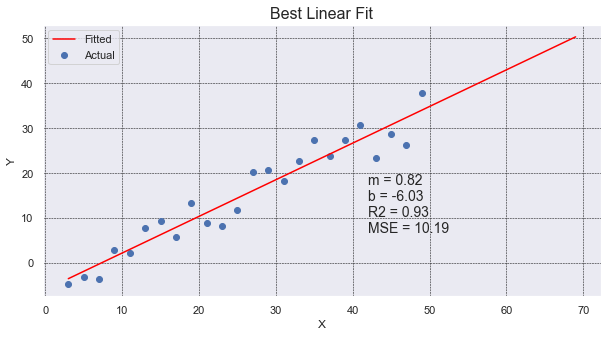
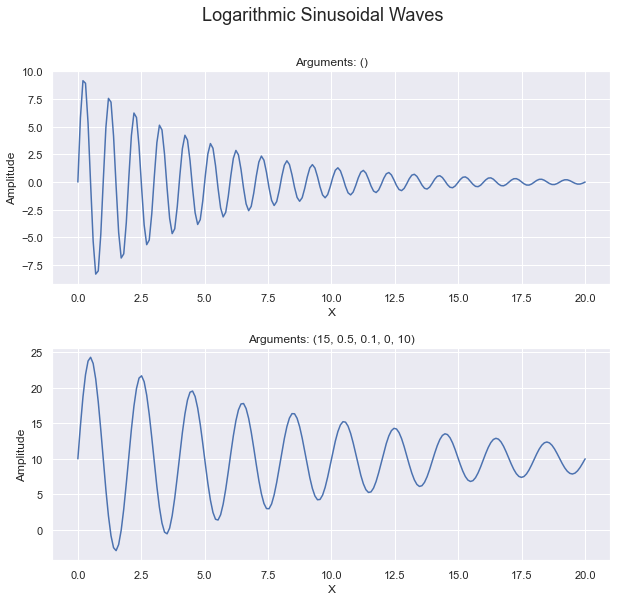
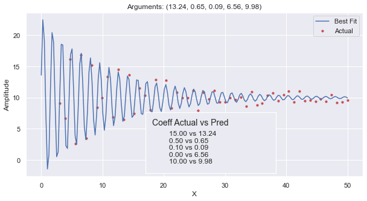

# Curve of Best Fit
In this section, we will show how you can identify a Curve of Best Fit for a set of data points.
You can choose the form of the equation of the line; it can be a line, parabola, polynomial of order 4 or more,
or some custom equation like Sigmoid.  

We will review three different ways to get the equation of a fitted curve.  
1. `scipy.stats.linregress`: a statistical method that identifies a line's coefficients as well some statistical information.  
2. `numpy.polyfit`: a Numpy method that identifies the coefficients of any n-ordered polynomial.  
3. `scipy.stats.curve_fit`: a statistical method that identifies the coefficients of **_any_ function** as well as some statistical information about the fit.  

In identifying a Curve of Best Fit, it is good to know _how good_ the curve is at representing
the data points. You should quanitify that it is better worse than a parabola. We can do some of this with 
the Mean Squared Error.  

Often we want to know how much of a correlation there is between the x & y data points. Afterall, 
we may have just asked Seaborn to plot a regression line and the line presented is the best line that fits the
data, but is the data linearly related at all? This is a different, but also important question! This is
answered by looking at the `Coefficient of Determination`.  

```{admonition} $R^2$ or Coefficient of Determination  
:class: dropdown tip
R-squared ($R^2$) is a statistical measure that provides an indication of how well the line of best fit (the regression line) fits the data points. It quantifies the proportion of the variance in the dependent variable (y) that can be explained by the independent variable (x) in a linear regression model.

The R-squared value ranges from 0 to 1. A value of 1 indicates that the regression line perfectly predicts the dependent variable, meaning all the data points lie exactly on the line. A value of 0 indicates that the regression line does not explain any of the variance in the dependent variable, and the points are scattered randomly.

In general, a higher R-squared value indicates a better fit of the line to the data. For example, an R-squared value of 0.8 means that 80% of the variability in the dependent variable is accounted for by the independent variable(s) in the model.
```

Here is a table that shows some of the most frequent API we used in this section. 

|API|Notes|  
|---|-----|
|[plt.plot](https://matplotlib.org/stable/api/_as_gen/matplotlib.pyplot.plot.html)|This does a simple line plot on the current axis. It does not offer 'ax=ax' argument.|  
|[plt.scatter](https://matplotlib.org/stable/api/_as_gen/matplotlib.pyplot.scatter.html)|This does a simple scatter plot on the current axis. It does not offer 'ax=ax' argument.|  
|[np.linspace](https://seaborn.pydata.org/generated/seaborn.regplot.html)| This creates a numpy array of values linearly spaced between [start, end] with a specific number of points. It is helpful in generating `x_data` during plotting.|   
|[np.polyfit](https://numpy.org/doc/stable/reference/generated/numpy.polyfit.html)|This identifies the coefficients of any n-ordered polynomial.|   
|[linregress](https://docs.scipy.org/doc/scipy/reference/generated/scipy.stats.linregress.html)|a statistical method that identifies a line's coefficients as well some statistical information.|  
|[curve_fit](https://docs.scipy.org/doc/scipy/reference/generated/scipy.optimize.curve_fit.html#scipy.optimize.curve_fit) |A statistical method that identifies the coefficients of **_any_ function** as well as some statistical information about the fit.|  
|[mean_squared_error](https://scikit-learn.org/stable/modules/generated/sklearn.metrics.mean_squared_error.html)|Calculates the Mean Squared Error (MSE) from two sets of y_data points.|  

## Seaborn Regression
In many research projects, it is beneficial to find a curved line that best fits the data.
Students will often do a scatter plot of the data points and have Seaborn do a regression plot
which shows a line of best fit with a shaded area around the line representing
a 95% confidence interval. None of that is horrible. It is convenient to have a line of best fit, 
if there is one. And, `regplot` will draw one for you by default.  

````{tab-set}
```{tab-item} Image
  
```
```{tab-item} Code
```python
def function():
    pass
```
```{tab-item} Comments
Comments go here.
```
````
However,
in assignment that measured performance, I did work to find Mean Square Error


https://seaborn.pydata.org/tutorial/regression.html
http://seaborn.pydata.org/generated/seaborn.regplot.html
Can extend the x-axis and set regplot(truncate=False) to extend line out.

## SciPy Linregress
````{tab-set}
```{tab-item} Image

```
```{tab-item} Code
```python
def function():
    pass
```
```{tab-item} Comments
Comments go here.
```
````

## Numpy Polyfit
````{tab-set}
```{tab-item} Best Fit Plot

```
```{tab-item} Code
```python
def function():
    pass
```
```{tab-item} Comments
Comments go here.
```
````

## Curve Fit
````{tab-set}
```{tab-item} Sinusoidal

```
```{tab-item} Best Fit

```
```{tab-item} Code
```python
def function():
    pass
```
```{tab-item} Comments
Comments go here.
```
````

# ML regressions
https://realpython.com/linear-regression-in-python/
https://datagy.io/mean-squared-error-python/
`model = LinearRegression()`
Students will often pursue a Machine Learning model to do predictions which it is great at doing. 
ML models are intended to do predictions.

# SciPy & NumPy Regressions
https://docs.scipy.org/doc/scipy/reference/generated/scipy.stats.linregress.html
This is a good way when using scatter plots. Seaborn doesn't seem to give the value when finding
the line of best fit.
https://www.askpython.com/python/coefficient-of-determination 