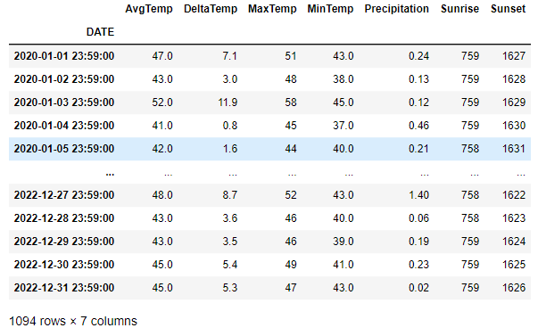
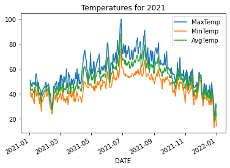
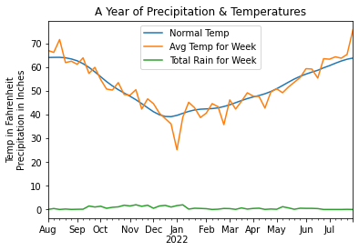
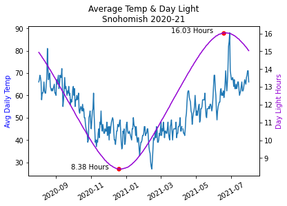

# Line Plots

Line Plots are likely the most common plot you'll create in IDP. It is fantastic for 
<a href='geospatial.html#correlations-and-coefficient-of-determination'>showing correlations</a>. While line plots are not complicated, it can be frustrating
to draw multiple lines as you intend. Furthermore, there are many different API available to draw lines and they
accept different named arguments (which is frustrating!). 

On this page you'll see how to:  
* draw multiple lines using various libraries  
* do Time-Slices of a `TimeSeries`  
* rescale the axis for specific lines only  
* customize line styles  

## Libraries
There are several different libraries and objects that allow you to plot a line. The one you use depends on the structure of your data and the complexity of your plot. I have found that the most useful object to use when drawing is the `DataFrame` where you can do most of what you want to do. When doing subplots, using the `Axes` object becomes invaluable.  

You should read and become familiar with all the named arguments and options for each library/object.  

|Library|API|Comments|
|-------|---|--------|
|Pandas|[DataFrame.plot](https://pandas.pydata.org/pandas-docs/stable/reference/api/pandas.DataFrame.plot.html)|Recommended and most common method of plotting in IDP| 
|Matplotlib.pyplot|[plt.plot](https://matplotlib.org/stable/api/_as_gen/matplotlib.pyplot.plot.html)|The fundamental plotting API. All other objects will essentially call this one eventually. Access to more named arguments, but **works on only one axis.**|
|Matplotlib.axes|[axes.plot](https://matplotlib.org/stable/api/_as_gen/matplotlib.axes.Axes.plot.html#matplotlib.axes.Axes.plot)|Allows one to target a plot to a specific axes. Very useful in customizing figures with multiple subplots.| 
|Pandas|[Series.plot](https://pandas.pydata.org/pandas-docs/stable/reference/api/pandas.Series.plot.html)|Useful when the object is a `Series`|
|Seaborn|[sns.lineplot](https://seaborn.pydata.org/generated/seaborn.lineplot.html)|Also works on unpivoted data. Provides simple access to some statistics and various styles of drawing lines.|   

```{admonition} Helpful Resources/API 
:class: seealso dropdown
* [matplotlib Colors](https://matplotlib.org/stable/gallery/color/named_colors.html) : List of color names  
* [plt.clf](https://matplotlib.org/stable/api/_as_gen/matplotlib.pyplot.clf.html) : Clear the current figure  
* [plt.gca](https://matplotlib.org/stable/api/_as_gen/matplotlib.pyplot.gca.html) : Get figure's axes  
* [plt.xticks](https://matplotlib.org/stable/api/_as_gen/matplotlib.pyplot.xticks.html#matplotlib.pyplot.xticks) : Customize the x-axis tick marks and/or labels. Note that `**kwargs` applies to the style of the text and are documented [here](https://matplotlib.org/stable/api/text_api.html#matplotlib.text.Text)  
* [ax.annotate](https://matplotlib.org/stable/api/_as_gen/matplotlib.axes.Axes.annotate.html#matplotlib.axes.Axes.annotate) : Draws text on the axes  
```

## Data

The data is three years of temperature data from Snohomish county. This page will do some computations and data organization
to enable better plots, but this is what the data basically looks like. We load it as a `TimeSeries` using `pd.read_csv`.    


## DataFrame

````{tab-set}
```{tab-item} Simple
In this very simple, one line, `df.plot()`, we default to drawing all columns using the `index` as the x-axis. We see that by default, there is no label
for the y-axis and the x-axis ticks are rotated for us. The `Sunrise` and `Sunset` columns cause all the other data to be
squashed down to the bottom due to the units being 24-hour time. Furthermore, the 24-hour time causes there to be "jumps"
in the data because it will jump from 1059 to 1100 since 1075 is not a valid time. We will fix this below.  
  
```python
# This will plot all columns on the same axes so long as all the values
# in each cell is a numerical value
df.plot()
# move the legend to the side by tying the upper-left of the legend
# to the coordinate (1,.9) which is in units of percentages of the drawn figure.
plt.legend(loc='upper left', bbox_to_anchor=(1.0, 0.9))
plt.title('Default Graph of a DataFrame')
```
```{tab-item} Multi-Line
We can very easily plot a specific set of lines by providing a list of column names. This plot is identical
to the plot shown in the "Min & Max" tab below.   
  
```python
df.plot(y=['MinTemp', 'MaxTemp'], legend=False)
plt.title('Min/Max Temperatures')
```
```{tab-item} Subplots
We can create a relatively complex figure with four subplots using one line of code. We set just
a few things: figure size, columns to plot on `y`, line styles, grid lines turned on, and xlabel.  

By providing just a few named arguments, we can get a pretty complex figure dran in 1 line!  
  
```python
df.plot(figsize=(8,10),
        y=['MaxTemp', 'Normal', 'Precipitation', 'Day Light'], 
        subplots=True, title='Weather Summary', grid=True,
        style=['-', ':', '--', '-.'], xlabel='')
```
````


## Simple Plots
````{tab-set}
```{tab-item} Temperatures
  
We take a `slice` of the dataframe using `loc` and then plot only three columns.  
```python
# do a time-slice using the fact that we have a TimeSeries and plot only 2021
# plot the three lines on the DataFrame by providing all the column names
df.loc['2021-01':'2021-12'].plot(y=['MaxTemp', 'MinTemp', 'AvgTemp'])
plt.title('Temperatures for 2021')
```
```{tab-item} Day light
  
We do some math on `Sunrise` and `Sunset` to convert them to fractions of an hour and thereby eliminate the
apparent jumping.  We convert the minutes `t%100` to be a percentage of an hour. The following code
adds three new columns `['SunsetHr', 'SunriseHr', 'Day Light']` to the DataFrame and then plots `Day Light`.  
```python
for col in ['Sunset', 'Sunrise']:
    df[col+'Hr'] = df[col].apply(lambda t: t//100 + (t%100)/60)
df['Day Light'] = (df['SunsetHr'] - df['SunriseHr'])
df['Day Light'].plot()
plt.title('Hours of Daylight')
```
```{tab-item} Min & Max
  
```python
# we can grab one Series at a time and plot those on the same figure/axes.
df['MinTemp'].plot()
df['MaxTemp'].plot()
plt.title('Min/Max Temperatures')
```
```{tab-item} Custom Line
  
We can customize the line using some parameters to the `plt.plot` method. In most cases, you'll
want to use one of the string shorthand representations of linestyles. `['-', '--', ':', '-.']`  But,
we choose to set a custom dashed style, because we can. See [linestyle documentation](https://matplotlib.org/stable/gallery/lines_bars_and_markers/linestyles.html) for more details.  
```python
# Time-Slice the first 2 weeks of 2020
january = df['MaxTemp'].loc['2020-01-01':'2020-01-14']
# Set line color, width, style and markers.
plt.plot(january, color='tab:purple', linestyle=(0, (2, 3, 2, 3, 10, 3)), marker='x', linewidth=2)
plt.xticks(rotation=30)
plt.title('2 Weeks Max Temp in January 2020')
```
````

## Twinx Plots
There are times when we want to plot two lines together but their units are dramatically different.
You can see this impact in the DataFrame Default image at the top of this page. 

Here we will look at an example where the the units gets in the way of our plot. Then, we will
address it using `twinx`. [Online example](https://matplotlib.org/stable/gallery/spines/multiple_yaxis_with_spines.html)  

Let's plot the normal temperature (average temperature over many years)
along with the the average current temperature and the amount of current precipitation.
````{tab-set}
```{tab-item} First Attempt
  
Here you'll see how the amount of precipitation is dwarfed by the scale of the temperatures. Below is the code
used to generate the above plot. Note that we `resample` at the week interval to smooth out the data. And,
for precipitation, we use `sum` instead of `mean` to get a larger, more representative value.  

We also use `loc` to do a time-slice of the data which is easy because our DataFrame is a
<a href='https://cse163.github.io/book/module-3-pandas/lesson-9-time-series/time-series.html' target='_blank'>TimeSeries.</a>
Python semantically understands the date strings.  
```python
# Creating a DataFrame and ploting it is very simple and gets us most of 
# what we want. We ae missing a proper scale for the rain.

# Resample the Average Temperature at the weekly rate to remove noise.
at = df['AvgTemp'].loc['2021-08':'2022-07'].resample("W").mean()

# Resample and sum up the rain for the week to amplify the values. 
# Using a mean() value has the amount of rain too small.
rain = df['Precipitation'].loc['2021-08':'2022-07'].resample('W').sum()

# To have a valid DataFrame, we need an equal number of rows in each column.
# Eventhough the normal temperature is already smooth, we resample to reduce
# the number of rows to match the other columns and to give a good mean value. 
sn = df['Normal'].loc['2021-08':'2022-07'].resample("W").mean()

# Create the data frame from a dictionary representation of these 3 Series.
df_year = pd.DataFrame({'Normal Temp': sn, 
                        'Avg Temp for Week': at, 
                        'Total Rain for Week': rain})
df_year.plot()
plt.title('A Year of Precipitation & Temperatures')
# The y-axis represents two units!
plt.ylabel('Temp in Fahrenheit\nPrecipitation in Inches')
# Remove 'DATE' from label as it is obvious
plt.xlabel('')
```
```{tab-item} Rescaled
  
In this new version, we've done several things differently. First, we didn't build a DataFrame
because a DataFrame is restricted to having the same number of values in each column. Instead, 
we use plot using the `Series` object which gives us some added flexibility.
We `resample`d each `Series` at a different rate to have finer control over how
we smooth the curve. To make the precipitation be more pronounced, we summed up the values
over a **two week** period.  

When I was developing this sample, I encountered a problem where the legends displayed separately, one for each axis. To fix
this problem, I got help from ChatGPT which showed me how to combine the 'handles' and 'labels' into a single legend.  
```python
fig, ax1 = plt.subplots(1)

# No need to resample - the curve is smooth
sn = df['Normal'].loc['2021-08':'2022-07'] 
# To smooth out the Avg Temp curve, weekly is sufficient
at = df['AvgTemp'].loc['2021-08':'2022-07'].resample("W").mean()  
# Resample bi-weekly to smooth out the curve even more
rain = df['Precipitation'].loc['2021-08':'2022-07'].resample('2W').sum()

# This needs to be set before calling the plot() method
plt.xticks(rotation=60)

# Be sure to set the labels here for retrieval later
ax1.plot(sn.index, sn.values, label='Normal Temp', color='b')
ax1.plot(at.index, at.values, label='Avg Weekly Temp', color='orange')
ax1.set(xlabel='', ylabel='Fahrenheit')
# create another axis 
ax2 = ax1.twinx()
ax2.plot(rain.index, rain.values, label='Total Bi-Weekly Rain', color='g')
ax2.set_ylabel('Total Rain for Week', color='g')

# The above code creates two distinct legends. 
# Let's combine the two sets into a single legend.
handles1, labels1 = ax1.get_legend_handles_labels()
handles2, labels2 = ax2.get_legend_handles_labels()
combined_handles = handles1 + handles2
combined_labels = labels1 + labels2
# position the upper-left of the legend to the coordinates (1.0, 0.9)
# where these are percentages of the size of the figure. This pushes
# the legend to the right of the figure
fig.legend(combined_handles, combined_labels, loc='upper left', bbox_to_anchor=(1.0, 0.9))
plt.title('A Year of Rain & Temperatures')
```
````

### Another Twinx Example
This example is nice because it annotates the daylight curve with the length of the day. 
The plot shows how the average temperature "lags" the length of the day: the temperature
doesn't change immediately with the length of the day.  

The code takes a time-slice for a 12 month period. When finding the equinox points,
we make use of Tuple packing and unpacking to combine two lines of code into one line. This is a bit
of a trick and is a nice way to shorten highly similar code.
````{tab-set}
```{tab-item} Image
 
```
```{tab-item} Code
```python
avg = df['AvgTemp'].loc['2020-08':'2021-07']
day_len = df['Day Light'].loc['2020-08':'2021-07']

# find the minimum and maximum daylight days.
# Use Tuple packing and unpacking to reduce the line count. Trick!
min_day, max_day = day_len.idxmin(), day_len.idxmax()
min_len, max_len = day_len[min_day], day_len[max_day]

# Create a figure and a set of subplots
fig, ax1 = plt.subplots(1)

# Plot the first series on the left y-axis
# We need to set the rotation before we plot
plt.xticks(rotation=30)
ax1.plot(avg.index, avg.values, color='tab:blue')
ax1.set_ylabel('Avg Daily Temp', color='b')
ax1.set_xlabel('')

# create a second axes for better visualization of Day Length
ax2 = ax1.twinx()

# plot the Day Length and set the label
ax2.plot(day_len.index, day_len.values, color='darkviolet')
ax2.set_ylabel('Day Light Hours', color='darkviolet')

# plot the min/max with red points and annotate the day length
ax2.scatter([min_day, max_day], [min_len, max_len], color='red', s=30)
for x, y in zip([min_day, max_day], [min_len, max_len]):
    # right alight the text to the xy-offset value
    ax2.annotate(f'{y:.2f} Hours', (x, y), textcoords='offset points', 
             xytext=(-15,0), ha="right", color='black')

plt.title('Average Temp & Day Light\nSnohomish 2020-21')
```
````

## Seaborn
I've found that using Seaborn is helpful in only a few situations.  
1. When the data is in the "unpivoted" format.  
2. When you have multiple y-values at the same x-value and you want to average them out automatically.  
3. When you have many lines that you want to plot with different colors.  
4. When you want to differentiate the lines using `size` or `style`.  
5. When you want to do a scatter plot and do a [line of best fit](line_of_best_fit). 


```{admonition} Pivoted vs Unpivoted
:class: seealso dropdown
**PIVOTED**  
The _"pivot"_ format is where the data is simply organized by column. There is a column that contains the x-values,
and there is a column that contains the y-values. In the data shown below, we would use the column `year` as the x-value,
and the columns `investment` and/or `return` as the y-value to draw one or two lines.   
  

**UNPIVOTED**  
The _"unpivoted"_ format is where there is a column dedicated to expressing which "line" the row belongs to.
For example, in the data shown below, you might use the `DATE` column of the DataFrame as the x-axis, use
the `value` column as the y-value and have different lines depending on the `source` column. In other words,
You'd have one line for 'MaxTemp' and another line for 'AvgTemp'. In this example, the `source` column 
contains the name of the line that the data belongs to.  
  

Here is code that shows how we can restructure the data from one format to the other.  
* [df.melt](https://pandas.pydata.org/pandas-docs/stable/reference/api/pandas.DataFrame.melt.html?highlight=dataframe%20melt#pandas.DataFrame.melt)  
* [df.pivot](https://pandas.pydata.org/pandas-docs/stable/reference/api/pandas.DataFrame.pivot.html)  
```python
df_unpivoted = df_pivoted.melt(value_name='value', var_name='source', ignore_index=False)
df_unpivoted.reset_index(inplace=True)

# go back to the original pivoted format
df_original = df_unpivoted.pivot(index='DATE', columns='source', values='value')
```